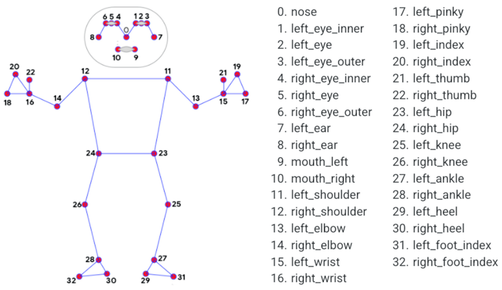

# Motion Capture and Animation in Unity

Eng | [Rus](resources/readme_localisation/readme_ru.md)

## Description

This project demonstrates how to use Python with OpenCV image capture to achieve:

``` text
* Human motion detection and recognition; 

* Subsequent data transmission to Unity in real-time;

* Animation of characters using the obtained data and IK Animation. 
```

### The project consists of two components

* **Motion Capture** - this part is designed to recognize humans, process values, and send them to clients. Implemented in `python`. In `config.ini`, information about which IP address and port to send information to and whether to draw the camera's image in real-time with point capture processing is stored.

* **Body Control 3D Model** - here we are dealing with receiving data about body points and further use. Implemented in `Unity`. In the `StreamingAssets/config.json` file, information about which IP address and port to receive information from is stored.

The `Motion Capture` project must be started first, and only then the `Body Control 3D Model` project, otherwise Unity hangs. When finished, first stop the `Body Control 3D Model`, then the `Motion Capture`.

### Scheme of point capture on a human body



## Description of Demonstration Projects in Unity

### Example 1. Primitives

Upon start, spheres are created to serve as examples of capture points, as well as lines connecting certain capture points, thereby resembling a human body.

A controller that receives data over the socket, processes the received data, and moves the spheres according to their positions obtained from the data.


### Example 2. IK Animation

In this example, a ready-made `Unity-chan` model is used. The model's rig is set up for hands, feet, head, and the model moves relative to the position of the captured person at the center of the camera.

A controller that receives data over the socket, processes the received data, and iterates through the set points, moving each such point, each point has information about its index and stores the Transform object. Also, the main body movement occurs, the center is calculated using mathematical calculations and body and leg coordinates.


## Information

### Author and Developer

* Kirill Shutov (ShutovKS), Russia

### License

``` text
MIT License
```
